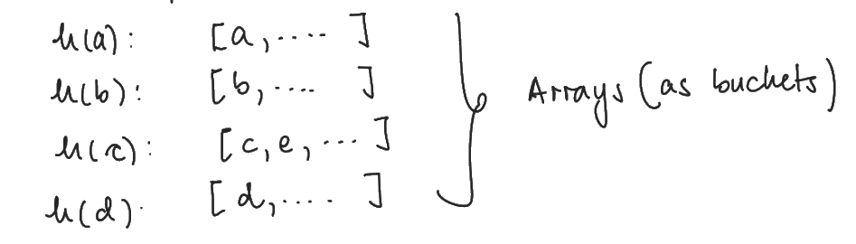

# Data Structures

### Primitives
Data types include **primitives**, these are the simplest data structures.

Different languages use different primitives, in `C` we have:
- int
- float
- double
- long
- char
---
### Arrays

Fixed-size **arrays** of elements of **same** type - include **strings** (char arrays):
- Not able to append new values (i.e. size **not** allocated dynamically) - memory is located **consecutively**.
- Accessing scales as $\mathcal{O}(1)$.
- Summing scales as $\mathcal{O}(n)$.
- Checking an element scales as $\mathcal{O}(n)$.
- Modification is more difficult (e.g. **appending** new elements):
	1. Allocate memory that will be required for modified array.
	2. Copy the array to the new memory address - scales as $\mathcal{O}(n)$.
	3. Append the new element.
---
### Linked Lists

**Linked lists** are arrays of **pairs**, where the **first** element of each pair is the data, and the **second** element is a **pointer** to the memory address of the next element.
- Scalings for **accessing**, **appending**, and calculating **length** are all $\mathcal{O}(n)$.
- Useful educational tools - otherwise **inefficient** and rarely used.
- Good exercise to go through at least **once** - if you know `C` give this a go!
- **Double linked lists** contain a pointer to the **previous** and **subsequent** element addresses.

Examples in element and address:

| (a,2) | NULL | (b,3) | (c,5) | NULL | (d,5) |
|--|--|--|--|--|--|
| 0 | 1 | 2 | 3 | 4 | 5 |

E.g. The element `a` is stored at address `0`, and contains a**pointer** to the address to the next element `b`, stored at address `2`.

Element `b` is stored at address `2` and contains a pointer to the address `3` at which `c` is stored ...

---
### Hash Functions

**Hash functions** translate any number of elements to a **fixed amount** of numbers:
- Not unique in general.
- Best implementations are **(pseudo-)random** and **impossible** (or at least very difficult) to **invert**.
- Used to verify **integrity/equality** (e.g. cryptography).
---
### Hash Sets
For a variable of type $T$, and a **hash function** $h:T\rightarrow\mathbb{N}$, we can construct an array of size $m$ in a memory block of size $n>m$, we can assign to each element an address $A\in \mathbb{N}$:
$$A = h(a)\mathrm{mod}(n).$$

Operations scale as:
- Access $\mathcal{O}(1)$.
- Append $\mathcal{O}(1)$.
- Checking $\mathcal{O}(1)$.
- Length $\mathcal{O}(n)$.

This data structure is a **hash set**.

Potential **collisions** can occur if the same address $A$ is produced by the mod hash function for two different values $a,b\in T$

Simplest collision avoidance: Use arrays as **buckets** to store multiple objects with the same hash.
- Then collisions are avoided by **checking** if the elements **already present** in the bucket differs from the entry.
- This avoids checking over the whole array as there will be no probability of finding the element elsewhere.

**General advice**: If you care about ordering, **do not use** hash sets - this tool is useful for checking quickly if something exists.

**Example**: a hash set of size $m=5$ in a memory slot of size $n=9$.
|  |
|--|
|  |

In this example there is a collision with elements $c$ and $e$ as illustrated in the bucket.

---
### Hash Map
A **hash map** is similar to a hash set, except between two elements per entry: a **key** and **value**.

Examples include **dictionaries** in python, **maps** in `C++`
- In a hash set: $a$ is placed at position: $h(a)\mathrm{mod}(n).$
- For a hash map  the **value** $v$, and **key** $k$ can be accessed by storing $v$ at position $h(k)\mathrm{mod}(n).$

Analogy: telephone book
- When searching for a friend's phone number, you have access to the **key** (the name of your friend) and require the **value** (the phone number).
- The index of your phone book refers to information relating to the **keys**, as this is the information you have access to e.g. Jack's number will be stored under the category of names beginning with 'J', this is analogous to the **mod hash of the key**.
- Normally, the ''bare'' **hash of the key** is stored with the **value** to avoid collisions e.g. you would not just have Jack's number in category 'J', but could also have James' - despite that the mod hash is the same.
